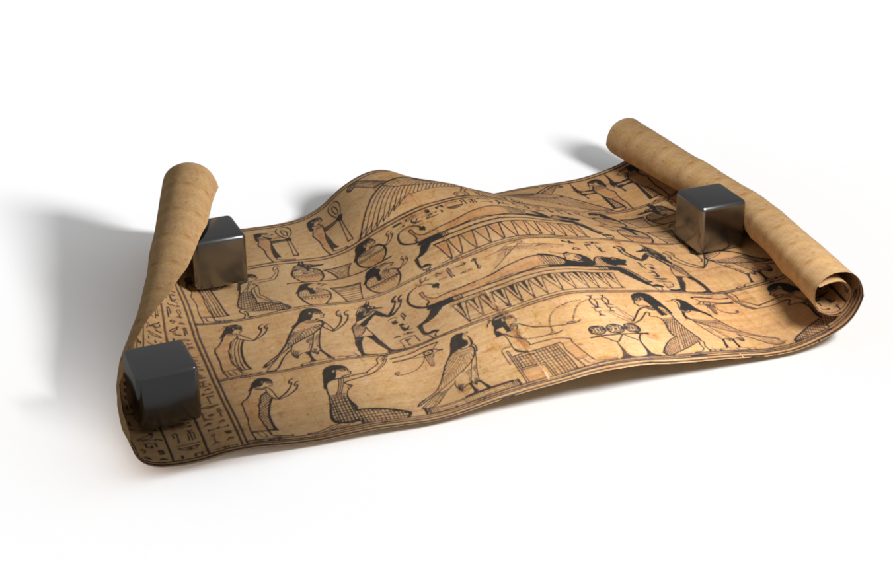
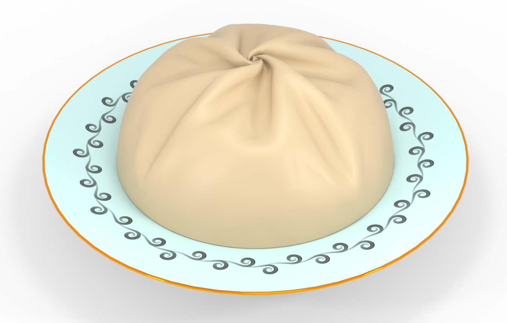
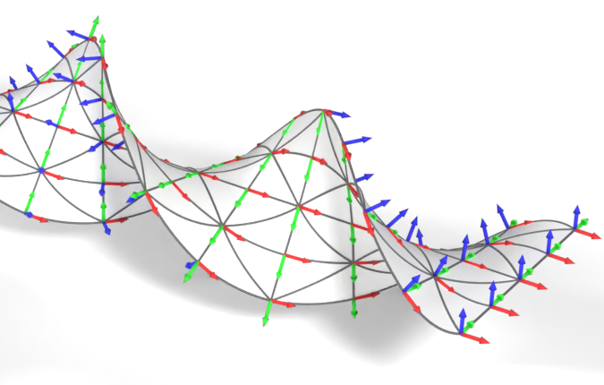

# Curved Three-director Cosserat shells in *Stark*

This repository contains the source code used to produce the results for our paper:

> Löschner, F., Fernández-Fernández, J.A., Jeske, S.R. and Bender, J., 2024. **Curved Three-Director Cosserat Shells with Strong Coupling**. Computer Graphics Forum (CGF), DOI: 10.1111/cgf.15183.

Please also see the [entry on our website](https://animation.rwth-aachen.de/publication/0589/) for access to the paper, the supplemental document, video and more.
For newcomers to [**Stark**](https://github.com/InteractiveComputerGraphics/stark), please also check out the [upstream repository](https://github.com/InteractiveComputerGraphics/stark) without the paper specific additions.

 
  &nbsp;&nbsp;
 
  &nbsp;&nbsp;
 

## Overview

This repository is a fork of [**Stark**](https://github.com/InteractiveComputerGraphics/stark) [1], a C++ simulation platform that provides easy access to state-of-the-art methods to robustly solve simulations of rigid and deformable objects in a strongly coupled manner.
For most users who are *not* specifically interested in implementation details of the paper or reproducing experiments, we recommend to use the upstream [**Stark**](https://github.com/InteractiveComputerGraphics/stark) repository without the modifications of this project.

Notable additions on top of the main Stark repository to facilitate the experiments of the paper include:

 - The specific simulation "scenes" for all experiments of the paper which define material parameters, boundary conditions, scripting etc.. See [`examples/main.cpp`](examples/main.cpp).
 - General FEM basis functions and quadrature rules used to discretize and evaluate the Cosserat models. In addition to the standard first- and second-order Lagrange triangle elements (`Tri3`, `Tri6`) presented in the paper, the code here is slightly more general and also contains third-order triangle elements (`Tri10`) as well as bilinear and biquadratic quadrilaterals (`Quad4`, `Quad9`). See [`fem_elements.h`](stark/src/models/fem_elements.h).
 - The implementation of the three-director Cosserat plate and shell models, previously presented by Nebel et. al. 2023 [2], that we solve in an incremental potential context with strong coupling. See [`EnergyMicropolarShell.cpp`](stark/src/models/deformables/surface/EnergyMicropolarShell.cpp). 
 - An implementation of a Kirchhoff-Love shell model with support for arbitrary hyperelastic materials as introduced by Wen and Barbič 2023 [3] for qualitative comparisons. See [`EnergyTriangleStrainWen23.cpp`](stark/src/models/deformables/surface/EnergyTriangleStrainWen23.cpp).

## Build instructions

The project uses CMake as a build system and should work on Windows, Linux and MacOS.
A few notes:
 - Some scenes use meshes found in the "`models`" folder of the repository. When running these scenes, the application assumes that the current working directory of the process is the root of this repository (i.e. the "`models`" folders is reachable as "`./models`").
 - On Linux and MacOS we use Clang for code generation at runtime (compilation of derivatives) which requires Clang to be installed and its executable to be in `PATH`.
   On Windows MSVC is used for compilation at runtime which might require adapting the path in the `compiler_command` variable in the file [`Compilation.cpp`](stark/extern/symx/src/Compilation.cpp)
 - By setting the CMake variable `STARK_ENABLE_MKL` to `ON` you can enable Intel MKL for the direct solver which was also used for the timings and experiments in the paper.
   By default the project will instead fall back to the LU decomposition implementation of Eigen.
   For the compilation with MKL to succeed, the appropriate environment variables have to be set.
   On Windows this is usually achieved by starting the IDE or compilation from an "Intel oneAPI command prompt" that can be opened from a shortcut in the start menu after installation of MKL.
   On Linux MKL should be detected automatically if it was installed from the official repositories.
 - On Apple Silicon devices it might be required to set `STARK_ENABLE_AVX` to `OFF`.

## References
 - [1] [Fernández-Fernández, J.A., Lange, R. and Laible, S. and Arras, K.O. and Bender, J., 2024. **STARK: A Unified Framework for Strongly Coupled Simulation of Rigid and Deformable Bodies with Frictional Contact**. 2024 IEEE International Conference on Robotics and Automation (ICRA).](https://ieeexplore.ieee.org/document/10610574)
 - [2] [Nebel, L.J., Sander, O., Bîrsan, M. and Neff, P, 2023. **A geometrically nonlinear Cosserat shell model for orientable and non-orientable surfaces: Discretization with geometric finite elements**. Computer Methods in Applied Mechanics and Engineering.](https://www.sciencedirect.com/science/article/pii/S0045782523004334)
 - [3] [Wen, J. and Barbič, J., 2023. **Kirchhoff-Love Shells with Arbitrary Hyperelastic Materials**. ACM SIGGRAPH Asia 2023.](https://dl.acm.org/doi/10.1145/3618405)

## License

The code in this repository (except for the files in the "`models`" folder that are explicitly mentioned below) is licensed under the Apache-2.0 license (in accordance with Stark itself at the time when this repository was forked). See [`LICENSE`](LICENSE).

The `armadillo_*` and `bunny_*` mesh variants in the "`models`" folder are variations of the [Armadillo and Stanford Bunny meshes, courtesy of the Stanford Computer Graphics Laboratory](http://graphics.stanford.edu/data/3Dscanrep/).

